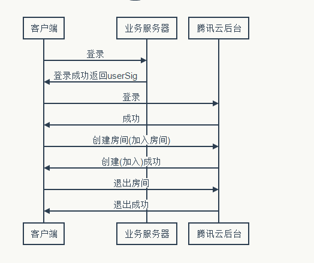
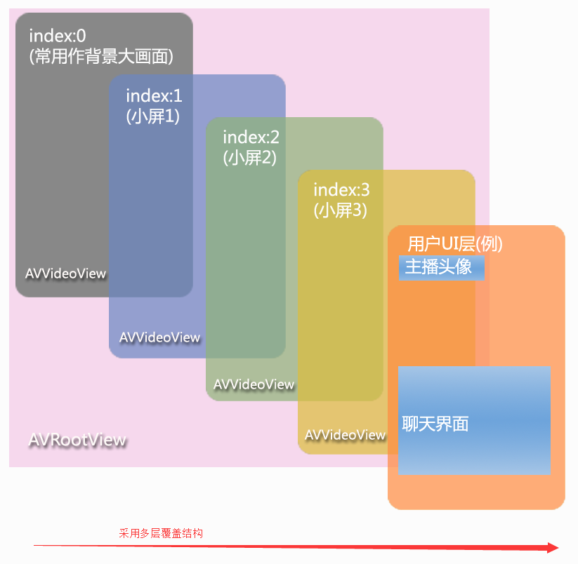

# LiveSDK直播基础接口简介
## 概述

LiveSDK基于[ILiveSDK](https://github.com/zhaoyang21cn/ILiveSDK_Android_Demos)，实现直播业务功能封装，方便开发者快速搭建自己的直播服务平台


## 集成
LiveSDK在Android Studio上开发。 导入只需要在gradle里增加一行（后面是版本号）,查看[版本更新说明](./live_release.md)

```
compile 'com.tencent.livesdk:livesdk:1.1.2'
```


## 简单直播流程示例




### 1 初始化 
| 接口名|  接口描述  |
|---------|---------|
| **initSDK** | iLiveSDK的部分类的预初始化，是所有行为的第一步，告知身份appId|


| 参数类型| 说明 |
|---------|---------|
| Conext | 建议用AppcalicationContext |
| int | 传入业务方appid |
| int | 传入业务方 accounttype |

* 示例
  
```java 
//iLiveSDK初始化
ILiveSDK.getInstance().initSdk(getApplicationContext(), appid, accoutype);
//初始化直播场景
ILVLiveConfig liveConfig = new ILVLiveConfig();
ILVLiveManager.getInstance().init(liveConfig);
```  


### 2 账号登录
| 接口名|  接口描述  |
|---------|---------|
| **iLiveLogin** | 使用托管方式或独立模式，在获取到用户的sig后，使用登录接口，告知后台音视频模块上线了（包括avsdk）|

| 参数类型| 说明 |
|---------|---------|
| String | 用户id,在直播过程中的唯一标识  |
| String | 鉴权的密钥Sig 如果是独立登录方式，是业务方后台计算生成后下发的|
| ILiveCallBack | 帐号登录回调接口。通知上线是否成功 |
<br/>
* 示例
    
```java     
ILiveLoginManager.getInstance().iLiveLogin(ILiveSDK.getInstance().getMyUserId(), "123456", new ILiveCallBack() {
                @Override
                public void onSuccess(Object data) {
                    bLogin = true;
                    Toast.makeText(ContactActivity.this, "login success !", Toast.LENGTH_SHORT).show();
                }

                @Override
                public void onError(String module, int errCode, String errMsg) {
                    Toast.makeText(ContactActivity.this, module + "|login fail " + errCode + " " + errMsg, Toast.LENGTH_SHORT).show();
                }
            });
```      
### 3 创建房间

| 接口名| 接口描述 |
|---------|---------|
| **createRoom** | 创建一个直播，只有在初始化和登录成功之后才能创建直播|

| 参数类型| 说明 |
|---------|---------|
| int | 房间id 房间唯一标识 建议由业务方后台统一分配  |
| ILVLiveRoomOption | 房间配置项 可以设置角色 权限 主播ID 摄像头参数等 具体参考类ILVLiveRoomOption |
| ILiveCallBack | 创建房间回调接口。通知创建房间是否成功 |

```java            
  //创建房间配置项
            ILVLiveRoomOption hostOption = new ILVLiveRoomOption(null)
                    .controlRole(Constants.HOST_ROLE)//角色设置
                    .authBits(AVRoomMulti.AUTH_BITS_DEFAULT)//权限设置
                    .cameraId(ILiveConstants.FRONT_CAMERA)//摄像头前置后置
                    .videoRecvMode(AVRoomMulti.VIDEO_RECV_MODE_SEMI_AUTO_RECV_CAMERA_VIDEO);//是否开始半自动接收
           //创建房间
            ILVLiveManager.getInstance().createRoom(room, hostOption, new ILiveCallBack() {
                @Override
                public void onSuccess(Object data) {
                    Toast.makeText(LiveActivity.this, "create room  ok", Toast.LENGTH_SHORT).show();
                    logoutBtn.setVisibility(View.INVISIBLE);
                    backBtn.setVisibility(View.VISIBLE);
                }

                @Override
                public void onError(String module, int errCode, String errMsg) {
                    Toast.makeText(LiveActivity.this, module + "|create fail " + errMsg + " " + errMsg,   Toast.LENGTH_SHORT).show();
                }
            });
```
### 4 加入房间
| 接口名|  接口描述  |
|---------|---------|
| **joinRoom** | 观众角色调用加入房间接口|


| 参数类型| 说明 |
|---------|---------|
| int | 房间id 房间唯一标识 建议由业务方后台统一分配  |
| ILiveRoomOption | 房间配置项 可以设置角色 权限 主播ID 摄像头参数等 具体参考类ILiveRoomOption |
| ILiveCallBack | 加入房间回调接口。通知加入房间是否成功 |
<br/>

```java  


           //加入房间配置项
            ILVLiveRoomOption memberOption = new ILVLiveRoomOption(hostId)
                    .autoCamera(false) //是否自动打开摄像头
                    .controlRole(Constants.NORMAL_MEMBER_ROLE) //角色设置
                    .authBits(AVRoomMulti.AUTH_BITS_JOIN_ROOM | AVRoomMulti.AUTH_BITS_RECV_AUDIO |              AVRoomMulti.AUTH_BITS_RECV_CAMERA_VIDEO | AVRoomMulti.AUTH_BITS_RECV_SCREEN_VIDEO) //权限设置
                    .videoRecvMode(AVRoomMulti.VIDEO_RECV_MODE_SEMI_AUTO_RECV_CAMERA_VIDEO) //是否开始半自动接收
                    .autoMic(false);//是否自动打开mic
            //加入房间
            ILVLiveManager.getInstance().joinRoom(room, memberOption, new ILiveCallBack() {
                @Override
                public void onSuccess(Object data) {
                    bEnterRoom = true;
                    Toast.makeText(LiveActivity.this, "join room  ok ", Toast.LENGTH_SHORT).show();
                    logoutBtn.setVisibility(View.INVISIBLE);
                    backBtn.setVisibility(View.VISIBLE);
                }

                @Override
                public void onError(String module, int errCode, String errMsg) {
                    Toast.makeText(LiveActivity.this, module + "|join fail " + errMsg + " " + errMsg, Toast.LENGTH_SHORT).show();
                }
            });
```            
            
            
### 设置渲染层
> 渲染层级示例图 在界面层xml插入一个AVRootView,音视频数据最终是通过AVRootView渲染出来。考虑多屏互动情况，AVRootView实际上不是一层View而是多层AVVideoView的叠加。直播业务默认主播在第0层默认最大，其他互动观众分别在1，2，3层。每层大小都可以动态调节。
> 


* 示例

```java
    <com.tencent.ilivesdk.view.AVRootView
        android:id="@+id/av_root_view"
        android:layout_width="match_parent"
        android:layout_height="match_parent"
        android:background="@color/white" />
        
        
        avRootView = (AVRootView) findViewById(R.id.av_root_view);
        ILVLiveManager.getInstance().setAvVideoView(avRootView);
```  
        
[信令及上麦参见](./ILVLiveSenior.md)        

## API文档
[API文档1.1.1](https://zhaoyang21cn.github.io/iLiveSDK_Help/livesdk/)

